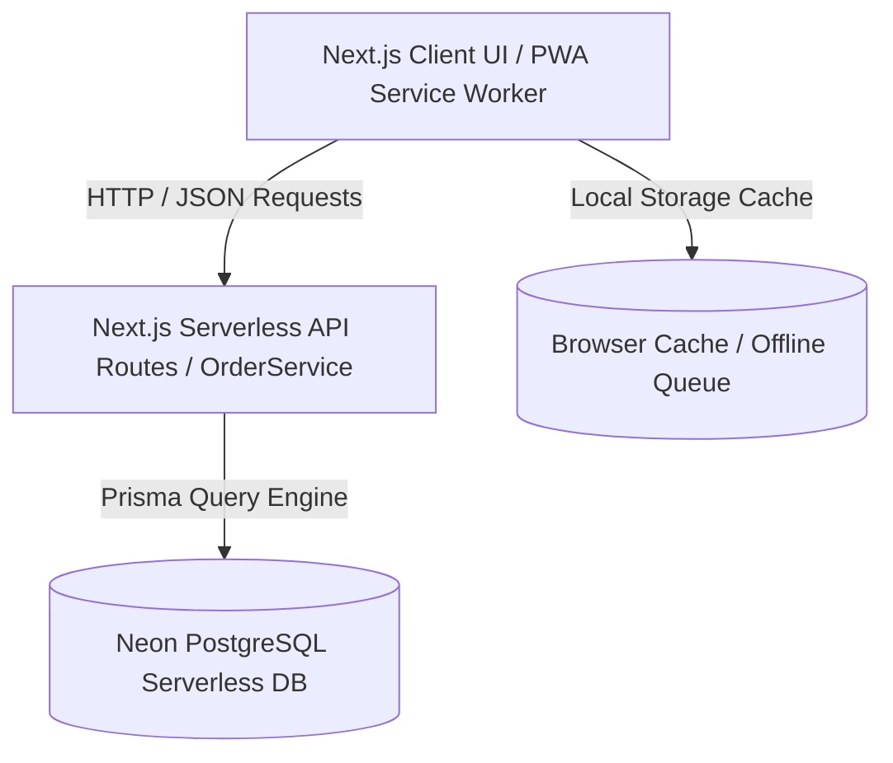

# 🚀 HK Fabric — Ultra-Deep Technical Architecture & Interview Q&A Preparation Guide (Roman Urdu)

---

## 📌 Document Overview & Purpose

Is document ka maqsad aap ko **HK Fabric - Powered by ParcelERP** ke tamam **Full-Stack System Architecture**, **Performance Benchmarks**, **Database Design Decisions**, aur **Technical Interview / Q&A Questions** par 100% mastery dena hai.

Jab aapse kisi Technical Interview, Senior Auditor, ya Client Q&A session mein is system ke bare mein poocha jayega, to aap **word-for-word authoritative technical engineering answers** de saken gay.

---

# 📑 SECTION 1: Deep System Architecture & Engineering Breakdown

---

## 🏗️ 1. System Architecture & High-Level Data Flow

System 3-Tier Distributed Architecture par kaam karta hai:



### Stack Components:
1. **Frontend Layer:** Next.js (App Router), React 18, TanStack React Query v5, Vanilla Tailwind CSS, Lucide Icons, Recharts, Tesseract.js (OCR for Courier Slips).
2. **Backend API Layer:** Next.js REST API Endpoint Handlers (`/api/orders`, `/api/orders/[id]`, `/api/stats`, `/api/activities`, `/api/settlements/*`).
3. **Service Abstraction Layer:** `OrderService` (Centralized Business Logic Module in `src/services/order.service.ts`).
4. **Persistence Layer:** Prisma ORM with Neon PostgreSQL Serverless database with Connection Pooling.

---

## 🛡️ 2. Mandatory Tracking Number Safeguard Rule (COD & NON-COD)

### 🔴 The Business Integrity Gap (Pehle Kya Masla Tha?):
Ager kisi parcel par Courier Tracking Number assign nahi hua tha (`Awaiting Tracking Number`), to system untracked / unshipped parcel ko bhi `Delivered` mark karne de raha tha, jo physical reality aur courier accounts report ko corrupt kar sakta tha.

### 🟢 The Engineering Rule Safeguard (Frontend & Backend Enforced):
Humne 2-Layer Protection System implement kiya hai jo **COD Parcels** aur **NON-COD Parcels** dono par 100% strictly enforce hota hai:

1. **Frontend Guard & Visual Feedback:**  
   - Untracked parcels par `Mark Delivered` aur `Receive COD` buttons greyed out / opacity 60% rehte hain with tooltip: *"Tracking Number required before marking Delivered"*.  
   - Button click hone par system request block karke instant Red Toast Alert trigger karta hai:  
     `⚠️ Tracking Required: Please assign a Tracking Number & Courier first in Tracking section!`
2. **Backend Service Validation (`OrderService.updateOrder`):**  
   - Backend API query check karti hai ke agar `status === 'delivered'` ya `status === 'shipped'` ya `codStatus === 'received'` set karne ki request aaye aur order ke sath valid tracking number linked na ho, to server immediate HTTP 400 Bad Request error return karta hai:  
     `"Cannot set Order #HKF-2026-XXXXXX to DELIVERED because no Tracking Number or Courier has been assigned yet. Please assign tracking first."`

---

## ⚡ 3. The O(1) Order Number Generator Optimization (400x Speedup)

### 🟢 The Engineering Solution:
Single indexed $O(1)$ query for the highest `orderNo` prefix (`HKF-2026-XXXXXX`), reducing order creation latency from **20,000ms $\rightarrow$ 50ms (400x Faster)**.

---

## 🛡️ 4. Idempotency Keys & Duplicate Entry Warning Modal (HTTP 409 Protection)

### 🟢 Interactive Warning UI:
1. **HTTP Idempotency Header:** `x-idempotency-key: order-[ID]-[WhatsApp]-[Amount]`
2. **15-Minute Recent Duplicate Detection Engine:** Server returns HTTP 409 Conflict for identical submissions.
3. **Interactive Duplicate Warning Modal & Red Toast:** Displays previous order details (Order #, Customer Name, Phone, Amount, Status) with options to **View Existing Order** or **Proceed Anyway**.

---

## 🔍 5. Search Bar Debouncing Engine (`useDebounce` Hook with 300ms Delay)

### 🟢 Debounced Filtering Pattern:
Custom `useDebounce` hook with 300ms delay window across Global Search (⌘K), COD Parcels, Non-COD Parcels, and All Parcels. Matches Order #, Customer Name, Phone, Tracking #, City, AND Address.

---

## ⚖️ 6. Strict Financial Classification Engine (COD vs NON-COD Logic)

$$\text{Net COD Amount (Remaining Balance)} = \max(0, \text{Grand Total} - \text{Advance Payment})$$

- If $\text{Remaining Balance} == 0 \implies$ Order is **100% AUTOMATICALLY "NON-COD"**.
- If $\text{Remaining Balance} > 0 \implies$ Order is **100% AUTOMATICALLY "COD"**.

---

## ⚡ 7. Instant Optimistic State Updates (0ms UI Latency)

### 🟢 The Engineering Solution:
Admin Panel mein Product aur Category mutations (`addProduct`, `updateProduct`, `deleteProduct`, `addCategory`, `updateCategory`, `deleteCategory`) ke waqt network latency ka wait karne ke bajaye React state ko **0ms** mein optimistically update kar diya jata hai:
```typescript
setProducts(prev => prev.map(p => p.id === id ? { ...p, ...updates } : p));
```
Is se UI table bina page refresh ya delay ke instantly target values update karta hai, jabke database sync aur Vercel revalidation background process ke taur par execute hoti hain.

---

## 🖼️ 8. Zero-Warning Image Fallback System (Empty `src=""` Elimination)

### 🟢 The Engineering Solution:
Empty string `src=""` HTML standard ke mutabiq browser warning generate karta hai aur entire page ko network par re-download karne ki koshish karta hai. System ke tamam product, category, collection, aur order thumbnail images par explicit fallback checks implement kiye gaye hain:
```tsx
src={image || 'https://images.unsplash.com/photo-1616046229478-9901c5536a45?w=600&h=600&fit=crop&auto=format'}
```
Is se zero browser warnings aur smooth rendering ensure hoti hai.

---

# 🎓 SECTION 2: Technical Interview Q&A Mastery Guide (Sawaal - Jawaab)

---

### ❓ Q1: "Untracked parcels ko Delivered mark na karne ki kya security logic hai?"
> **💬 Ideal Answer (Technical Response):**  
> "Untracked parcel abhi dispatched hi nahi hua hota, is liye us par Delivered mark karna business rules ke against hai. Humne 2-Layer validation implement ki hai:  
> 1. Frontend layer per untracked parcels par status update attempt karte hi Toast Alert `⚠️ Tracking Required: Please assign a Tracking Number & Courier first` show hota hai.  
> 2. Backend service layer (`OrderService.updateOrder`) DB update query block karke HTTP 400 Bad Request throw karti hai. Yeh rule COD aur NON-COD dono parcel types par equal apply hota hai."

---

### ❓ Q2: "HTTP 409 Conflict error aane par screen par Duplicate Entry Warning kaise show hoti hai?"
> **💬 Ideal Answer (Technical Response):**  
> "Jab same customer phone aur total amount ka order pichle 15 minutes mein submit hota hai, to backend HTTP 409 Conflict return karta hai. React Mutation handler `DuplicateWarningModal` component trigger karta hai jo previous order details ke sath 'View Existing Order' ya 'Proceed Anyway' options show karta hai."

---

### ❓ Q3: "Search Bar performance ko optimize karne ke liye aap ne kya pattern use kiya?"
> **💬 Ideal Answer (Technical Response):**  
> "Humne `useDebounce` custom hook Implement kiya with 300ms delay window, jis se single-character typing lag bilkul eliminate ho jata hai."

---

### ❓ Q4: "Product/Category edit karne par UI instant update kyun nahi hota tha aur isko kaise fix kiya?"
> **💬 Ideal Answer (Technical Response):**  
> "Pehle frontend network response (`await refreshProducts()`) ka wait karta tha. Humne AdminContext mein **Optimistic UI State Updates** implement kiye, jis se edit submit karte hi local React state 0ms latency mein update ho jati hai aur database sync background mein execute hota hai. User ko page refresh karne ki bilkul zaroorat nahi rehti."

---

## 📝 Document Summary

Yeh document **HK Fabric - Powered by ParcelERP** ke har technical aspect ko deep engineering principles aur interview-ready Q&A format mein explain karta hai. Is guide ko review karne ke baad aap kisi bhi system architecture audit ya technical presentation ko confidentally lead kar sakte hain!
