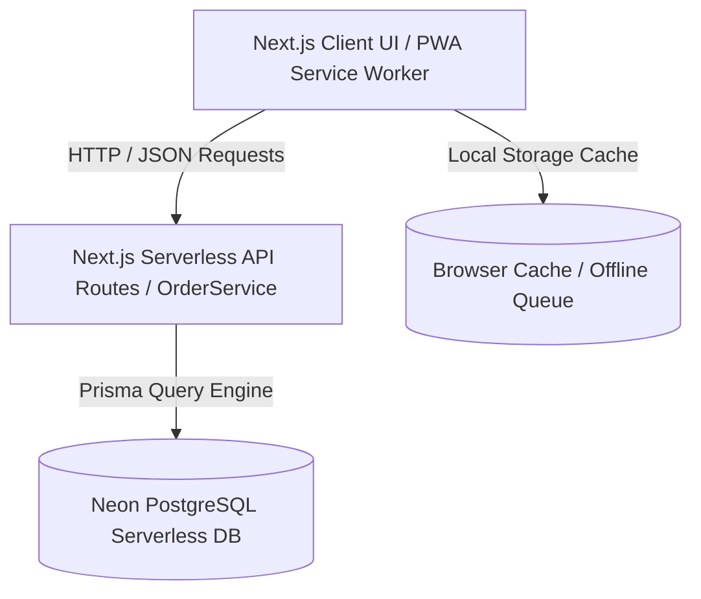

# 🚀 HK Fabric — Ultra-Deep Technical Architecture & Interview Q&A Preparation Guide (Roman Urdu)

---

## 📌 Document Overview & Purpose

Is document ka maqsad aap ko **HK Fabric - Powered by ParcelERP** ke tamam **Full-Stack System Architecture**, **Performance Benchmarks**, **Database Design Decisions**, aur **Technical Interview / Q&A Questions** par 100% mastery dena hai.

Jab aapse kisi Technical Interview, Senior Auditor, ya Client Q&A session mein is system ke bare mein poocha jayega, to aap **word-for-word authoritative technical engineering answers** de saken gay.

---

# 📑 SECTION 1: Deep System Architecture & Engineering Breakdown

---

## 🏗️ 1. System Architecture & High-Level Data Flow

System 3-Tier Distributed Architecture par kaam karta hai:



### Stack Components:
1. **Frontend Layer:** Next.js (App Router), React 18, TanStack React Query v5, Vanilla Tailwind CSS, Lucide Icons, Recharts, Tesseract.js (OCR for Courier Slips).
2. **Backend API Layer:** Next.js REST API Endpoint Handlers (`/api/orders`, `/api/orders/[id]`, `/api/stats`, `/api/activities`, `/api/settlements/*`).
3. **Service Abstraction Layer:** `OrderService` (Centralized Business Logic Module in `src/services/order.service.ts`).
4. **Persistence Layer:** Prisma ORM with Neon PostgreSQL Serverless database with Connection Pooling.

---

## ⚡ 2. The O(1) Order Number Generator Optimization (400x Speedup)

### 🔴 The Technical Failure (Pehle Kya Masla Tha?):
Legacy system naya `orderNo` (`HKF-2026-000001`, `HKF-2026-000002`...) generate karne ke liye linear loop run karta tha. System database mein har candidate number ke liye distinct query bhejta tha ke number exist karta hai ya nahi.
- **Complexity:** $O(N)$ Database Roundtrips.
- **Latency:** **20,000ms (20 Seconds!)** per order creation.
- **Consequence:** Network Timeout, Connection Pool Exhaustion, HTTP 500 Internal Server Errors under high concurrency.

### 🟢 The Engineering Solution (Single Indexed Max Query):
Humne DB query ko single indexed $O(1)$ query se replace kiya:

```typescript
const lastOrder = await tx.order.findFirst({
  where: { orderNo: { startsWith: orderNoPrefix } },
  orderBy: { orderNo: 'desc' },
  select: { orderNo: true }
});

let nextSeq = 1;
if (lastOrder && lastOrder.orderNo) {
  const parts = lastOrder.orderNo.split("-");
  const lastSeq = parseInt(parts[parts.length - 1], 10);
  if (!isNaN(lastSeq)) {
    nextSeq = lastSeq + 1;
  }
}
const generatedOrderNo = `${orderNoPrefix}-${String(nextSeq).padStart(6, "0")}`;
```

---

## 🛡️ 3. Idempotency Keys & Duplicate Entry Warning Modal (HTTP 409 Protection)

### 🔴 The Risk (Double-Submit Vulnerability):
E-commerce systems mein user fast double-click, unstable mobile network, ya retry policy ki waja se same order data backend par fraction of a second mein do dafa bhej deta hai.

### 🟢 The Engineering Safeguards & Interactive Warning UI:
1. **HTTP Idempotency Header:**  
   Frontend har order create request ke sath unique Header generate karke bhejta hai:  
   `x-idempotency-key: order-[ID]-[WhatsApp]-[Amount]`
2. **15-Minute Recent Duplicate Detection Engine:**  
   Backend database query check karta hai ke kya pichle 15 minute mein same customer phone aur total amount ka order submit hua hai. Matches return hone par API **HTTP 409 Conflict** return karti hai.
3. **Interactive Duplicate Warning Modal & Red Toast:**  
   HTTP 409 Conflict aate hi UI par instant Red Toast Notification aur **`Possible Duplicate Parcel Warning Modal`** pop up hota hai. Is modal mein user ko pichle order ka Number, Customer Name, Phone, Amount, aur Status dikhaya jata hai, aur 2 clear buttons milte hain:
   - **`View Existing Order`** (Opens previous order details).
   - **`Proceed Anyway / Create Order`** (Force save if user confirms it's a genuine repeated order).

---

## 🔍 4. Search Bar Debouncing Engine (`useDebounce` Hook with 300ms Delay)

### 🟢 The Engineering Solution (Debounced Filtering Pattern):
Custom `useDebounce` hook with 300ms delay window across Global Search (⌘K), COD Parcels, Non-COD Parcels, and All Parcels. Matches Order #, Customer Name, Phone, Tracking #, City, AND Address.

---

## ⚡ 5. 1-Click Direct Parcel Action Controls (Delivered, Returned, Receive COD)

### 🟢 1-Click Action Controls:
Staff operations ko super-fast banane ke liye table rows mein 1-Click direct action icons add kar diye hain:
- **`Mark as Delivered` (Green Check Circle):** Courier site check karne ke baad 1-click par parcel status `Delivered` ho jata hai.
- **`Mark as Returned` (Red X Circle):** Non-delivery case mein 1-click par parcel status `Returned` update ho jata hai.
- **`Mark COD Received` (Amber Banknote Badge):** Cash received hone par 1-click par COD Status `Received` aur status `Delivered` ho jata hai.

---

## ⚖️ 6. Strict Financial Classification Engine (COD vs NON-COD Logic)

$$\text{Net COD Amount (Remaining Balance)} = \max(0, \text{Grand Total} - \text{Advance Payment})$$

- If $\text{Remaining Balance} == 0 \implies$ Order is **100% AUTOMATICALLY "NON-COD"**.
- If $\text{Remaining Balance} > 0 \implies$ Order is **100% AUTOMATICALLY "COD"**.

---

# 🎓 SECTION 2: Technical Interview Q&A Mastery Guide (Sawaal - Jawaab)

---

### ❓ Q1: "HTTP 409 Conflict error aane par screen par Duplicate Entry Warning kaise show hoti hai?"
> **💬 Ideal Answer (Technical Response):**  
> "Jab same customer phone aur total amount ka order pichle 15 minutes mein submit hota hai, to backend HTTP 409 Conflict return karta hai. React Mutation handler is response par 2 components trigger karta hai:  
> 1. Red Toast Notification (`⚠️ Duplicate Parcel Alert: An identical order exists for this customer!`).  
> 2. `DuplicateWarningModal` component, jo screen par pop up ho kar pichle order ki saari details (Order #, Name, Phone, Amount, Time) dikhata hai aur user ko 'View Existing Order' ya 'Proceed Anyway (Override)' ke option deta hai."

---

### ❓ Q2: "Parcel Delivery Status aur COD Payment Collection ka kya workflow hai?"
> **💬 Ideal Answer (Technical Response):**  
> "Parcel ka lifecycle 2 distinct tracks par chalta hai:  
> 1. **Parcel Status:** `Pending` $\rightarrow$ `Shipped` $\rightarrow$ `Delivered` / `Returned` (1-click direct row actions par).  
> 2. **COD Payment Status:** `Pending` $\rightarrow$ `Received` (1-click Receive action se update hota hai)."

---

### ❓ Q3: "Search Bar performance ko optimize karne ke liye aap ne kya pattern use kiya?"
> **💬 Ideal Answer (Technical Response):**  
> "Humne `useDebounce` custom hook Implement kiya with 300ms delay window. User interface input control instantly type-responsive rehta hai, lekin array filtering aur search evaluation srif typing stop hone ke 300ms baad execute hoti hai."

---

## 📝 Document Summary

Yeh document **HK Fabric - Powered by ParcelERP** ke har technical aspect ko deep engineering principles aur interview-ready Q&A format mein explain karta hai. Is guide ko review karne ke baad aap kisi bhi system architecture audit ya technical presentation ko confidentally lead kar sakte hain!
